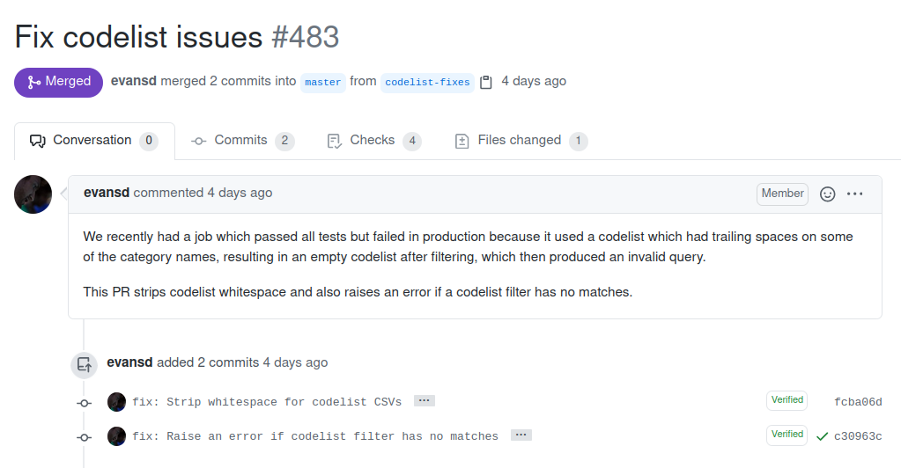

## What is a code review?

A code review is a critical quality assurance practice. It involves systematically
checking a fellow programmer's (or researcher's) code for potential errors or possible 
improvements. 

It is an everyday activity in the software development world and improves
both quality and speed in programming. Code reviews also offer opportunities for both code author and code reviewer to learn from each other. Code reviews are standard practice within OpenSAFELY studies and the default should be to always get your code reviewed.

## How to ask for a review

GitHub has a feature built into the workflow that allows easy code review with collaborators, and we would recommend 
that you use this tool. GitHub has some [documentation on pull requests and code reviews](https://docs.github.com/en/github/collaborating-with-issues-and-pull-requests/about-pull-request-reviews) which we recommend for background reading.

In this screenshot, the user is making a new pull request. In the top right-hand corner (marked by the
red box), there is a tagging function under Reviewers where you can search or select collaborators to do a code review. 
Once you have tagged them and made the pull request, the person will receive a notification to their
email, and it will also come up in the pull request section of their GitHub main screen.

It is strongly encouraged to add some information to 
your request to aid the reviewer. 
 
## When to ask for code review?

Code reviews should be the default. A good way of conceptualising when to ask for a review is to think about commits and branches. All your work should be done in branches and you should aim to 
merge your branches frequently. A user makes a branch to change a feature or adding some new analysis and make several commits to the new branch. When the time comes to merge this back to master, there is a natural inflexion point to do a code review, and each merge should be 
accompanied with a code review. If you are in a hurry, and no-one has time to do a more thorough 
code review, bear in mind that even a cursory code review is better than no code review. 

Merging a new branch should not be your only trigger for a review. If you are stuck or unsure what direction to take, a code review can clarify what path to take. In general, the more frequent the reviews, the better quality the code tends to be. 

## How can I write a good pull request?
Some best practice gathered from current users of OpenSAFELY are described below:

 - Thinking about the purpose of the review can be helpful as this may
vary from review to review. For example, are you looking for a check of the implementation of the logic or methods
outlined in the protocol (in which case, linking the protocol can aid this), or are you looking for a
review of how well you document your code and if it is clear and understandable? Being transparent
will help your reviewer do a better job quicker.
- Good descriptive names for pull requests and commits help the reviewer follow the logic of the code and the changes made (see example of commits below).
- Multiple smaller pull requests are easier than one large.
- Code comments and documentations make the logic easier to follow.
- Naming the order of the files, for example, `01_Data_Extraction.py`, `02_Data_Cleaning.py`, etc.
- Allow sufficient time for the review.

#### Examples of good commit messages

## How can I be a good reviewer?
Some best practices gathered from current users of OpenSAFELY are described below:

- Code review should be a collaborative conversation and don't be afraid to check assumptions or clarify intentions within the review (you can add messages to the end of the review request).
- Actionable feedback with suggestions is helpful.
- It can be helpful to highlight the levels of code review comments. For example,
if something is nice-to-have-but-not-important, you can prefix it with `Nit:`. For example,
`Nit: I think this would be cleared if you didn't use an underscore in this variable name`
- Being clear about what exactly you have reviewed or how thorough the review was - for example, being clear if you read through the code but did not run it (and therefore may miss running errors in implementation). Unit tests should catch that the code is runnable, but will not necessarily check it is correct.
- Answer specific questions in the review request.
- Avoiding jabs on coding style.
- Being clear if you do not have time to do a thorough review.

## What actions can we take as a team to encourage code reviews?

- Those in leadership roles should volunteer their time do code reviews, or help find code reviewers, to help embed the culture of code-reviews widely.
- New projects can have a "buddy" who can help to review the code, and means they will be familiar with the protocol and code changes from the start.

